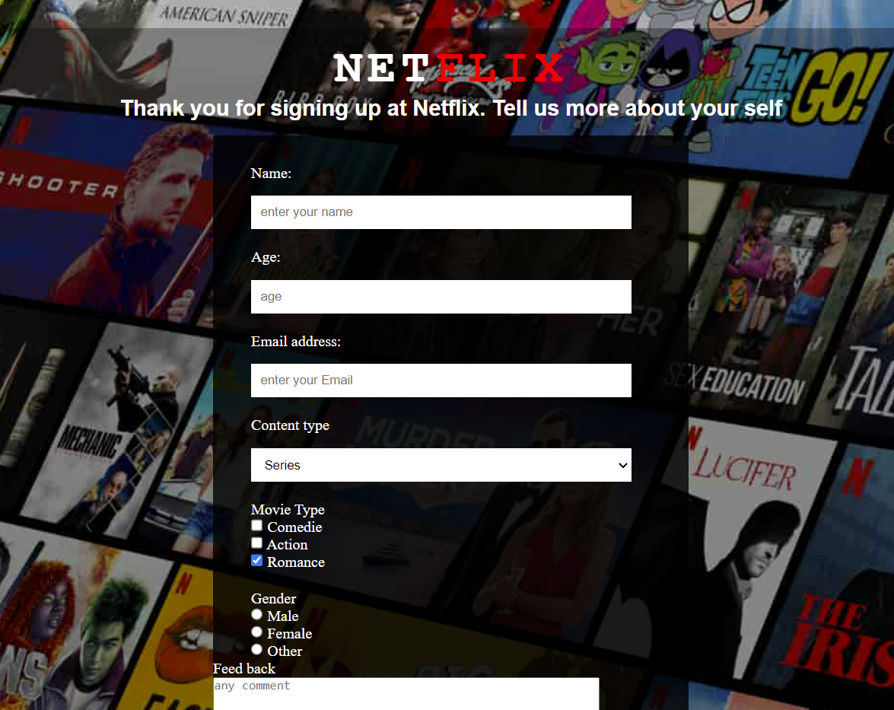

HTML and CSS Properties
#  :tv: Survey-Form-Netflix :clipboard:
> This survey form is a Netflix survey form, which created to take informations from user to practice CSS.

## Table of contents
  - [Table of contents](#table-of-contents)
  - [General info](#general-info)
  - [Technologies](#technologies)
  - [Features](#features)
  - [How to use](#how-to-use)
  - [Screenshots](#screenshots)
  - [Contact](#contact)

## General info
This project is created to sharpen the knowledge of CSS Properties along with form. It is a Project of The Clarusway IT School - Fullstack Developer Path.

## Technologies
* HTML
* CSS

## Features
* Has inline and external styling;
* tex, number, email types of input areas;
* dropdown, multiple selection, radio button areas 
* and text area and subit button

## How to use
Click on this [link](https://i-bilge.github.io/Survey-Form-Netflix/)

## Screenshot

## Contact
:mailbox_with_mail: You can send me email : iismailbilge@gmail.com :mailbox_with_mail:
